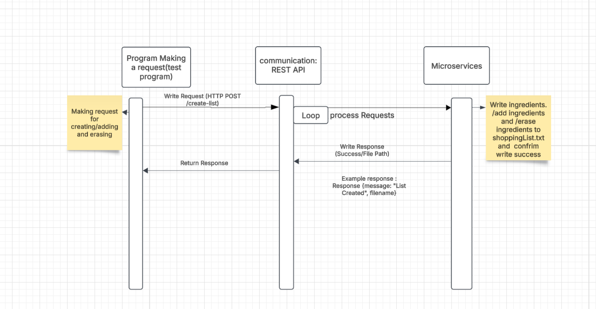

# Overview
This repository features a microservice designed to handle shopping lists, including the functionalities of creating lists, adding ingredients, and deleting lists.
# Getting Started 
## ***Prerequisites***
  Python 3.x 
  Flask
  Requests library
# Installation
1.	Clone the repository:
    ```shell
    git clone https://github.com/your-username/shopping-list-microservice.git
    cd shopping-list-microservice
    ```
2.	Install dependencies:
    ```shell
    pip install -r requirements.txt
    ```
3.	Run the microservice:
    ```shell
    python main.py
    ```
4.	Run tests:
    ```shell
    python test_main.py
    ```

# UML Diagram
  

# ***Endpoints***

1. Create Shopping List:
  **Endpoint:** `/create-list`
  **Method:** `POST`
  **Payload:**
     
```json
{
  "recipe_id": 1,
  "additional_ingredients": ["1 cup sugar", "2 eggs"],
  "clear_list": true
}
```
•	Example Call:
```python
response = requests.post('http://localhost:5001/create-list', json=payload)
```

2. Add Ingredients to Shopping List
  **Endpoint:** /add-ingredients
  **Method:** POST
  **Payload:**
```json
{
  "additional_ingredients": ["3 bananas", "1 liter milk"]
}
```

•	Example Call:
```python
response = requests.post('http://localhost:5001/add-ingredients', json=payload)
```
3. Erase Shopping List
  **Endpoint:** /erase-list
  **Method:** DELETE

  •	Example Call:
```python
response = requests.delete('http://localhost:5001/erase-list')
```
## Example Responses
1. Creating a Shopping List
```json
{
  "message": "Shopping list created",
  "filename": "shopping_lists/shoppingList.txt"
}
```

2. Adding Ingredients
```json
{
  "message": "Ingredients added",
  "filename": "shopping_lists/shoppingList.txt"
}
```

3. Erasing the Shopping List
```json
{
  "message": "Shopping list erased",
  "filename": "shopping_lists/shoppingList.txt"
}
```

## Contributing

Contributions are welcome! Please open an issue or submit a pull request.

## License

This project is licensed under the MIT License.


